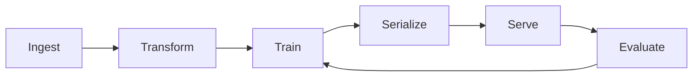

# Modular Pipeline Architecture

## Pipeline Components

Our recommendation pipeline is organized into clear, modular components:

```
pipeline/
├── ingest/          # Data ingestion from MovieLens
├── transform/       # Feature engineering and preprocessing
├── train/          # Model training (ALS, Collaborative Filtering, etc.)
├── serialize/      # Model serialization and versioning
├── serve/          # Model serving API
├── eval/           # Evaluation (offline and online)
└── config/         # Environment-based configuration
```

## Pipeline Flow



## Environment Configuration

Each component uses environment-based configuration:

```python
# config/pipeline_config.py
import os
from pydantic import BaseSettings

class PipelineConfig(BaseSettings):
    # Data paths
    data_path: str = os.getenv("DATA_PATH", "./data")
    model_path: str = os.getenv("MODEL_PATH", "./models")
    
    # Training parameters
    als_rank: int = int(os.getenv("ALS_RANK", "10"))
    als_iterations: int = int(os.getenv("ALS_ITERATIONS", "10"))
    
    # Serving parameters
    model_version: str = os.getenv("MODEL_VERSION", "latest")
    cache_ttl: int = int(os.getenv("CACHE_TTL", "300"))
    
    # Evaluation parameters
    eval_split_date: str = os.getenv("EVAL_SPLIT_DATE", "2000-11-01")
    eval_k_values: list = [5, 10, 20]
    
    class Config:
        env_file = ".env"
```

## Running the Pipeline

### Full Pipeline
```bash
python pipeline/run_pipeline.py --stages all
```

### Individual Stages
```bash
# Ingest data
python pipeline/run_pipeline.py --stage ingest

# Transform features
python pipeline/run_pipeline.py --stage transform

# Train model
python pipeline/run_pipeline.py --stage train

# Evaluate model
python pipeline/run_pipeline.py --stage eval
```

## Component Details

### 1. Ingest Module
- Downloads/loads MovieLens data
- Validates data integrity
- Stores in standardized format

### 2. Transform Module
- Feature engineering
- User/item embeddings
- Normalization
- Train/test splitting

### 3. Train Module
- Model training (ALS, CF, etc.)
- Hyperparameter tuning
- Cross-validation

### 4. Serialize Module
- Model versioning
- Artifact storage
- Model registry

### 5. Serve Module
- REST API endpoints
- Model loading
- Caching
- Request handling

### 6. Eval Module
- Offline metrics
- Online metrics
- A/B testing support
- Performance monitoring